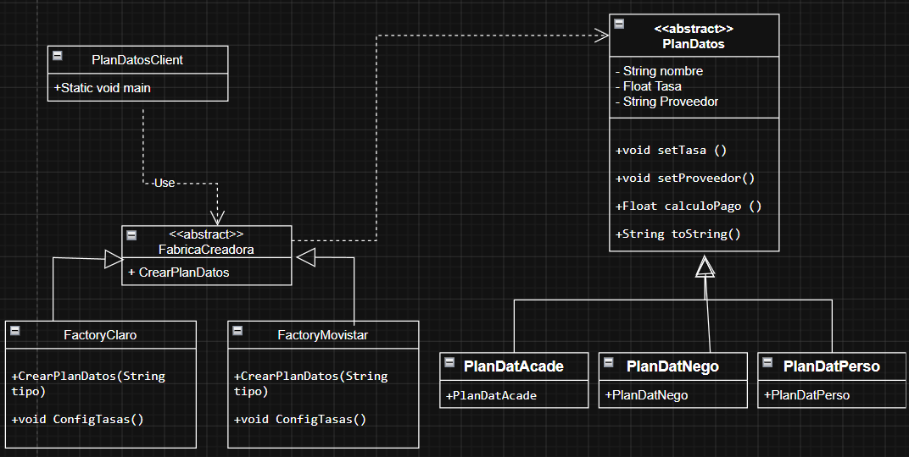

# Practica 013 - Patrones de Diseño de Software: Factory Method

## Contexto

La compañía de telefonía **Línea Rápida** ofrece tres planes de datos
(Personal, Negocio y Académico), cada uno con su propia tasa de pago por
mega. Además, se integran dos proveedores de internet (**Claro** y
**Movistar**), cada uno con su propio tarifario para esos mismos planes.
El objetivo era modelar esto en Java aplicando el patrón de diseño
**Factory Method**, de forma que el cliente pueda obtener el plan
correcto sin depender directamente de las clases concretas.

## Qué se trabajó

- Se diseñó y corrigió el diagrama de clases UML del patrón Factory Method.
- Se creó la clase abstracta `PlanDatos` (producto) y sus tres productos
  concretos: `PlanDatPerso`, `PlanDatNego`, `PlanDatAcade`.
- Se creó la clase abstracta `FabricaCreadora` (creador) y sus dos
  creadores concretos: `FactoryClaro` y `FactoryMovistar`, cada uno con su
  propio tarifario.
- Se implementó `Main.main` como cliente, calculando el pago de los tres
  planes para ambos proveedores con un consumo de 1000 megas.
- Se compiló y probó la salida por consola, y se versionó todo el proceso
  con Git usando Conventional Commits.

## Diagrama de clases

